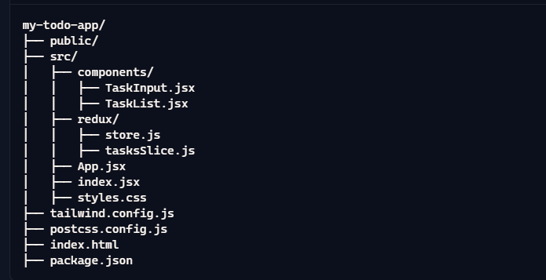
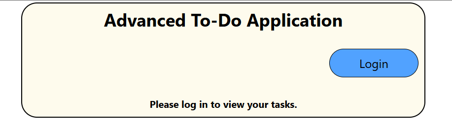
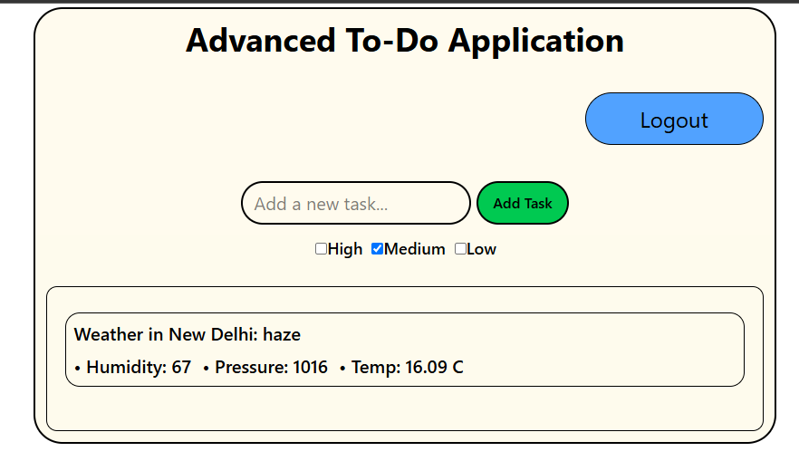
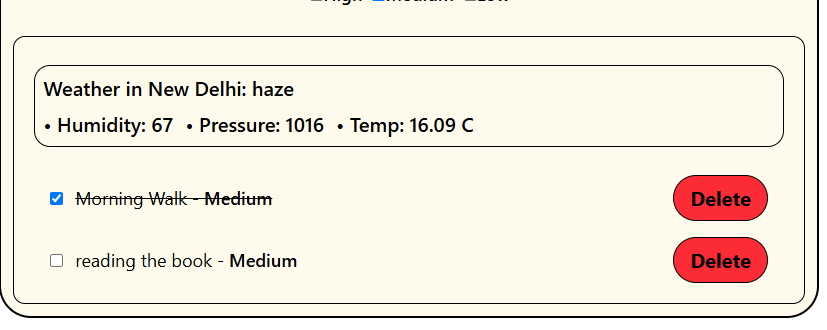

# Advanced React To-Do Application with API Integration

## Overview
This project is an advanced To-Do application developed using React and Vite. The application integrates external API data, implements advanced state management using Redux, and ensures responsiveness across different devices. The application features user authentication, task prioritization, and data persistence through local storage.

## Features
- **Add Task**: Users can input a task and add it to the list.
- **View Tasks**: Display all added tasks in a list format.
- **Delete Task**: Each task has a delete button to remove it from the list.
- **Task Prioritization**: Set priorities for tasks (High, Medium, Low) and display them accordingly.
- **Task Completion**: Mark tasks as completed with a checkbox and display completed tasks with a line-through style.
- **Weather Integration**: Display current weather conditions for a specific location using a public API.
- **Responsive Design**: Fully responsive design using Tailwind CSS to provide an excellent user experience on mobile, tablet, and desktop devices.
- **User Authentication**: Simulated login/logout functionality using Redux to protect the To-Do list behind authentication.

## Setup and Running Instructions

### Prerequisites
- Node.js (>= 12.x)
- npm (>= 6.x) or yarn

### Installation
1. Clone the repository:
    ```bash
    git clone https://github.com/YOUR_GITHUB_USERNAME/advanced-react-todo-app.git
    cd advanced-react-todo-app
    ```

2. Install the dependencies:
    ```bash
    npm install
    # or
    yarn install
    ```

3. Configure Tailwind CSS:
    ```bash
    npx tailwindcss init -p
    ```

4. Update the `tailwind.config.js` file:
    ```javascript
    module.exports = {
      purge: ['./index.html', './src/**/*.{js,ts,jsx,tsx}'],
      darkMode: false,
      theme: {
        extend: {},
      },
      variants: {
        extend: {},
      },
      plugins: [],
    };
    ```

5. Create a `.env` file in the root directory and add your API key:
    ```plaintext
    REACT_APP_WEATHER_API_KEY=YOUR_API_KEY
    ```

### Running the Application
1. Start the development server:
    ```bash
    npm run dev
    # or
    yarn dev
    ```

2. Open your browser and navigate to `http://localhost:3000` to view the application.

## Project Structure


## Intial Stage


## After Login Interface


## Task List



## Contributing
Contributions are welcome! Feel free to open an issue or submit a pull request.

## License
This project is licensed under the MIT License.